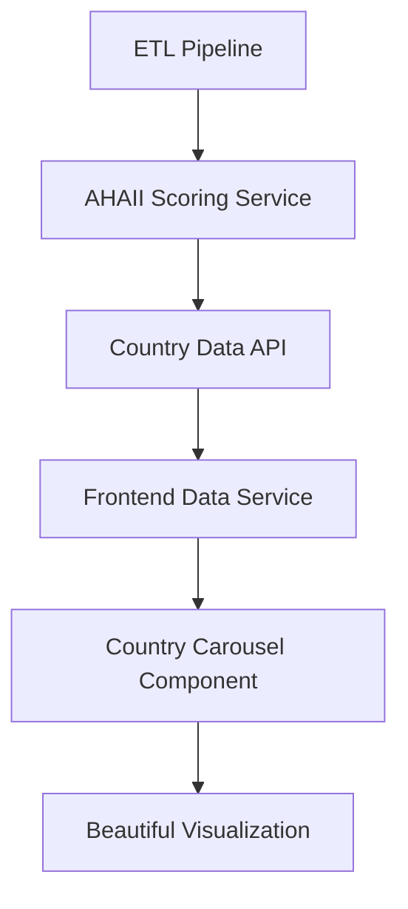

# AHAII Frontend-Backend Integration Specification
*Automated Country Intelligence Dashboard Architecture*

## 🎯 **Project Vision**

The AHAII dashboard transforms complex health AI infrastructure data into compelling visual intelligence. The frontend's role is to **accept data and make pretty graphs** while the backend generates automated country assessments from the ETL pipeline.

## 📊 **Data Flow Architecture**



### **Backend Responsibilities**
1. **ETL Data Collection**: Academic papers, news monitoring, policy tracking
2. **Automated AHAII Scoring**: Transform raw signals into readiness scores  
3. **Country Profile Generation**: Create complete country assessment profiles
4. **Real-time Updates**: Refresh scores as new intelligence arrives

### **Frontend Responsibilities**
1. **Data Consumption**: Accept formatted country data via API
2. **Visual Transformation**: Convert data into compelling carousel interface
3. **User Interaction**: Enable country exploration and detail navigation
4. **Real-time Updates**: Reflect new data automatically in UI

## 🔧 **Required Backend API Endpoints**

### **1. Featured Countries Endpoint**
```typescript
GET /api/countries/featured?limit=8
```
**Response Format:**
```json
{
  "countries": [
    {
      "id": "rwa",
      "name": "Rwanda",
      "iso_code_alpha3": "RWA",
      "region": "East Africa",
      "population": 13460000,
      "gdp_usd": 11070000000,
      "healthcare_spending_percent_gdp": 7.5,
      "ahaii_score": {
        "total_score": 78.5,
        "global_ranking": 23,
        "regional_ranking": 1,
        "human_capital_score": 82.3,
        "physical_infrastructure_score": 71.2,
        "regulatory_infrastructure_score": 79.8,
        "economic_market_score": 68.9,
        "readiness_tier": 1,
        "development_trajectory": "improving",
        "key_strengths": [
          "Strong digital health strategy",
          "Government commitment to AI",
          "Established EMR systems"
        ],
        "priority_improvement_areas": [
          "Increase healthcare funding",
          "Expand rural connectivity"
        ]
      },
      "recent_intelligence_count": 15,
      "last_updated": "2024-01-15T10:30:00Z"
    }
  ],
  "selection_criteria": "automated_scoring"
}
```

### **2. All Countries Endpoint**
```typescript
GET /api/countries/with-scores?include_estimated=true&min_confidence=0.5
```
**Purpose**: Get all 54 African countries with their AHAII scores for comprehensive views

### **3. Country Detail Endpoint**
```typescript
GET /api/countries/{country_id}/details
```
**Purpose**: Full country profile for dedicated country pages (`/country?id=rwanda`)

### **4. Real-time Activity Endpoint**
```typescript
GET /api/countries/recent-activity?hours=24&limit=10
```
**Purpose**: Countries with recent ETL intelligence activity for dynamic carousel rotation

## 🎨 **Frontend Component Architecture**

### **Core Components Built**

#### **1. CountryCarousel Component**
- **Location**: `/src/components/dashboard/CountryCarousel.tsx`
- **Purpose**: Near-full screen 3D carousel of country cards
- **Features**:
  - 3D perspective transforms with magnetic snap navigation
  - Automatic integration with your PNG flag/country images
  - Tier-based color coding and visual hierarchy
  - Hover states revealing additional country metrics
  - Click navigation to detailed country pages

#### **2. Country Data Service**
- **Location**: `/src/services/countryDataService.ts`  
- **Purpose**: Transform backend API data into frontend-ready structures
- **Features**:
  - Automatic mapping of ISO codes to image assets
  - Featured country selection algorithms
  - Real-time data refresh capabilities
  - React hooks for easy component integration

#### **3. Country Data Types**
- **Location**: `/src/types/country.ts`
- **Purpose**: TypeScript interfaces ensuring data consistency
- **Coverage**: Country profiles, AHAII scores, intelligence signals

#### **4. Static Country Database**
- **Location**: `/src/data/countries.ts`
- **Purpose**: All 54 African countries with image asset mappings
- **Features**: Automatic flag/outline/icon path generation from ISO codes

## 🖼️ **Image Asset Integration**

### **Your Tedious Work = Automated Beauty**
The frontend automatically maps country ISO codes to your prepared assets:

```typescript
// Automatic image path generation
const getFlagImagePath = (iso3: string) => {
  const countryName = iso3ToImageName(iso3); // "RWA" -> "rwanda"
  return `/images/countries/${countryName}-flag.png`;
}
```

**Asset Coverage:**
- ✅ **Flag PNGs**: `/images/countries/{country}-flag.png` 
- ✅ **Country Outline PNGs**: `/images/countries/{country}-country.png`
- ✅ **Country SVG Icons**: `/images/svg-icons/country-icons/{country}-icon-{light/dark}.svg`

## 🔄 **Automated Data Processing**

### **Backend ETL → Frontend Visualization Pipeline**

1. **ETL Collects**: Academic papers, news, policy documents
2. **Scoring Service Processes**: Transforms signals into infrastructure indicators
3. **AHAII Calculator**: Generates 4-pillar scores (Human Capital, Physical, Regulatory, Economic)
4. **API Serves**: Formatted country profiles with confidence scores
5. **Frontend Displays**: Beautiful carousel with real-time updates

### **No Manual Curation Required**
- **Featured Selection**: Algorithm chooses top countries based on scores, activity, regional diversity
- **Visual Hierarchy**: Automatic color coding, sizing, and positioning based on data
- **Real-time Updates**: New ETL data automatically refreshes carousel
- **54 Country Support**: Works for all African countries automatically

## 🎯 **Backend Implementation Priorities**

### **Phase 1: Core API Endpoints** ⚡ *High Priority*
1. **GET /api/countries/featured** - Powers the main carousel
2. **GET /api/countries/with-scores** - Comprehensive country listing  
3. **GET /api/countries/{id}/details** - Country detail pages

### **Phase 2: Automated Scoring** ⚡ *High Priority*  
1. **AHAII Scoring Service** - Transform ETL data into scores
2. **Confidence Calculation** - Data quality assessment
3. **Tier Classification** - Readiness tier determination (1, 2, 3)

### **Phase 3: Real-time Features** 🔄 *Medium Priority*
1. **Recent Activity Tracking** - Countries with new intelligence
2. **WebSocket Updates** - Real-time carousel refresh
3. **Intelligence Signal Processing** - Activity feed data

### **Phase 4: Advanced Analytics** 📊 *Lower Priority*
1. **Regional Comparison APIs** - Benchmarking endpoints
2. **Historical Trend Data** - Score progression over time
3. **Subcomponent Scoring** - Detailed pillar breakdowns

## 📋 **Data Quality Requirements**

### **Minimum Viable Data**
For a country to appear in the carousel:
- ✅ **Basic Profile**: Name, region, ISO codes (from existing database)
- ✅ **Economic Indicators**: Population, GDP, healthcare spending
- ⚠️ **AHAII Score**: At least estimated scores (can be low confidence)

### **Full Featured Data**
For rich country experience:
- ✅ **Complete AHAII Score**: All 4 pillars with confidence > 0.5
- ✅ **Recent Intelligence**: ETL activity in last 30 days
- ✅ **Trend Analysis**: Development trajectory assessment
- ✅ **Contextual Insights**: Key strengths and improvement areas

## 🚀 **Deployment Coordination**

### **Frontend Ready State**
✅ **Country Carousel**: Fully implemented and tested
✅ **Data Service**: API integration layer complete
✅ **Image Assets**: Automatic mapping to your PNG/SVG files
✅ **Dashboard Page**: Loading states and error handling
✅ **TypeScript Interfaces**: Data contracts defined

### **Backend Implementation Needed**
🔧 **API Endpoints**: Core country data endpoints
🔧 **AHAII Scoring**: Automated score calculation from ETL
🔧 **Database Integration**: Country profiles with scores
🔧 **ETL Data Processing**: Transform signals into indicators

### **Integration Testing Plan**
1. **Mock Data Phase**: Frontend uses static data for UI development
2. **API Integration**: Connect to backend endpoints as they're built
3. **Real Data Testing**: Validate with actual ETL pipeline data
4. **Performance Optimization**: Ensure smooth experience with all 54 countries

## 💡 **Key Design Principles**

### **1. Data-Driven Automation**
- No manual country curation for 54 countries
- Algorithm-based featured country selection
- Automatic visual hierarchy from data scores

### **2. Real-time Intelligence**
- ETL pipeline feeds directly into visualization
- Countries reorder based on new intelligence activity
- Live updates without page refresh

### **3. Visual Data Storytelling**
- Complex infrastructure data becomes intuitive carousel
- Your image assets create emotional connection to countries
- Progressive disclosure from overview to detailed exploration

### **4. Scalable Architecture** 
- Components accept any data format from backend
- Automatic adaptation to new countries/regions
- Extensible for additional metrics and visualizations

## 🎨 **Visual Design Excellence**

### **What Makes It Beautiful**
- **3D Perspective Effects**: Countries feel tangible and explorable
- **Your Image Assets**: Flags and country outlines create visual identity
- **Gradient Color System**: Tier-based coloring with domain-specific themes
- **Smooth Animations**: Framer Motion provides fluid interactions
- **Data Hierarchy**: Important information prominently displayed

### **Responsive Design**
- **Desktop**: Full 3D carousel experience
- **Tablet**: Adapted navigation with touch gestures  
- **Mobile**: Vertical scrolling with simplified metrics

This specification ensures the backend can implement the exact data contracts needed to power the beautiful frontend visualization. The frontend is ready to accept data and make pretty graphs - the backend just needs to provide the intelligence! 🎯✨